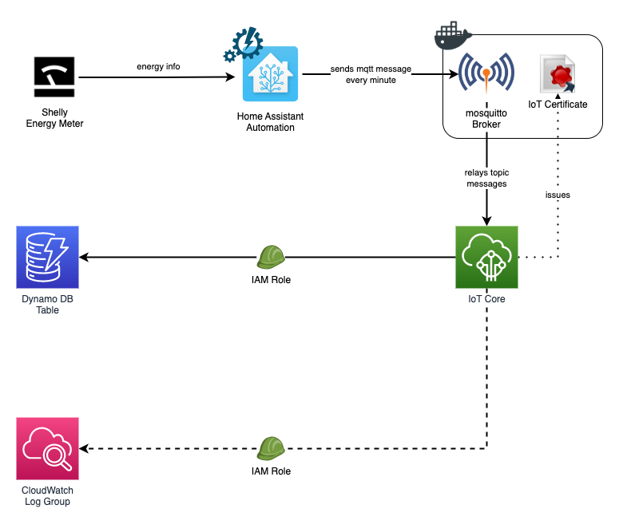

# aws-mqtt-broker

## Overview



## Local MQTT broker

In order to relay messages to the AWS IoT endpoint, a MQTT broker has to be set up. However, it seems that Home Assistant doesn't fully support ActiveMQ nor RabbitMQ, so the safer (and recommended by HA) alternative would be using `eclipse-mosquitto` which is an open source message broker that implements MQTT on its versions 3.1, 3.1.1 and 5.0. 

More info:

- [Project page](https://mosquitto.org/)
- [Github repo](https://github.com/eclipse/mosquitto)

### Bridge config

- `connection <connection_name>` will help identify the bridge in case there are more than one, both in Cloudwatch and the local mosquitto logs.
- `aws_iot_data_endpoint` is the AWS IoT MQTT endpoint our local bridge will connect to. Should be of the following shape `<random_prefix>-ats.iot.<aws_region>.amazonaws.com`. Can be retrieved through [Terraform outputs](../README.md#outputs).
- `client_id` is just a unique identifier for each client connected to the broker.
- `bridge_(ca|cert|key)file` are the SSL/TLS certificates used to connect to AWS IoT. The setup requires 3 files. An [Amazon public Root CA certificate](https://www.amazontrust.com/repository/AmazonRootCA1.pem), and the IoT Certificate (and Private Key) created with Terraform.

```
# ============================================================
# Bridge to AWS IOT
# ============================================================

connection <connection_name>

address <aws_iot_data_endpoint>:8883

<list_of_topics_to_bridge>

bridge_protocol_version mqttv311
bridge_insecure false

cleansession true
clientid <client_id>
start_type automatic
notifications false
log_type all

# ============================================================
# Certificate based SSL/TLS support
# ============================================================

bridge_cafile <root_ca_certificate_file>
bridge_certfile <aws_iot_created_certificate_file>
bridge_keyfile <aws_iot_created_certificate_private_key_file>

#END of bridge.conf
```

## Terraform stack
<!-- BEGIN_TF_DOCS -->
### Requirements

| Name | Version |
|------|---------|
| <a name="requirement_terraform"></a> [terraform](#requirement\_terraform) | ~> 1.3 |
| <a name="requirement_aws"></a> [aws](#requirement\_aws) | ~> 4.0 |

### Providers

| Name | Version |
|------|---------|
| <a name="provider_aws"></a> [aws](#provider\_aws) | 4.53.0 |
| <a name="provider_http"></a> [http](#provider\_http) | 3.2.1 |

### Resources

| Name | Type |
|------|------|
| [aws_dynamodb_table.iot_topic_data](https://registry.terraform.io/providers/hashicorp/aws/latest/docs/resources/dynamodb_table) | resource |
| [aws_iam_role.iot_logging](https://registry.terraform.io/providers/hashicorp/aws/latest/docs/resources/iam_role) | resource |
| [aws_iam_role.iot_push_to_dynamo](https://registry.terraform.io/providers/hashicorp/aws/latest/docs/resources/iam_role) | resource |
| [aws_iot_certificate.cert](https://registry.terraform.io/providers/hashicorp/aws/latest/docs/resources/iot_certificate) | resource |
| [aws_iot_logging_options.logging_config](https://registry.terraform.io/providers/hashicorp/aws/latest/docs/resources/iot_logging_options) | resource |
| [aws_iot_policy.pubsub](https://registry.terraform.io/providers/hashicorp/aws/latest/docs/resources/iot_policy) | resource |
| [aws_iot_policy_attachment.policy_attachment](https://registry.terraform.io/providers/hashicorp/aws/latest/docs/resources/iot_policy_attachment) | resource |
| [aws_iot_thing.home_assistant](https://registry.terraform.io/providers/hashicorp/aws/latest/docs/resources/iot_thing) | resource |
| [aws_iot_topic_rule.push_to_dynamo](https://registry.terraform.io/providers/hashicorp/aws/latest/docs/resources/iot_topic_rule) | resource |
| [aws_caller_identity.current](https://registry.terraform.io/providers/hashicorp/aws/latest/docs/data-sources/caller_identity) | data source |
| [aws_iam_policy_document.assume_role_policydoc](https://registry.terraform.io/providers/hashicorp/aws/latest/docs/data-sources/iam_policy_document) | data source |
| [aws_iam_policy_document.iot_thing](https://registry.terraform.io/providers/hashicorp/aws/latest/docs/data-sources/iam_policy_document) | data source |
| [aws_iam_policy_document.logging_role_policydoc](https://registry.terraform.io/providers/hashicorp/aws/latest/docs/data-sources/iam_policy_document) | data source |
| [aws_iam_policy_document.push_to_dynamo_policydoc](https://registry.terraform.io/providers/hashicorp/aws/latest/docs/data-sources/iam_policy_document) | data source |
| [aws_iot_endpoint.endpoint](https://registry.terraform.io/providers/hashicorp/aws/latest/docs/data-sources/iot_endpoint) | data source |
| [http_http.aws_iot_root_ca_cert](https://registry.terraform.io/providers/hashicorp/http/latest/docs/data-sources/http) | data source |

### Inputs

| Name | Description | Type | Default | Required |
|------|-------------|------|---------|:--------:|
| <a name="input_aws_iot_ca_cert_url"></a> [aws\_iot\_ca\_cert\_url](#input\_aws\_iot\_ca\_cert\_url) | URL for the AWS IoT Root CA Certificate | `string` | `"https://www.amazontrust.com/repository/AmazonRootCA1.pem"` | no |
| <a name="input_aws_region"></a> [aws\_region](#input\_aws\_region) | n/a | `string` | `"eu-west-1"` | no |
| <a name="input_iot_loglevel"></a> [iot\_loglevel](#input\_iot\_loglevel) | n/a | `string` | `"WARN"` | no |
| <a name="input_iot_thing_name"></a> [iot\_thing\_name](#input\_iot\_thing\_name) | n/a | `any` | n/a | yes |
| <a name="input_iot_topic_name"></a> [iot\_topic\_name](#input\_iot\_topic\_name) | Name of the topic (allows wildcards) for the query that gets data into DynamoDB | `string` | n/a | yes |

### Outputs

| Name | Description |
|------|-------------|
| <a name="output_aws_iot_root_ca_certificate"></a> [aws\_iot\_root\_ca\_certificate](#output\_aws\_iot\_root\_ca\_certificate) | n/a |
| <a name="output_iot_certificate"></a> [iot\_certificate](#output\_iot\_certificate) | n/a |
| <a name="output_iot_endpoint"></a> [iot\_endpoint](#output\_iot\_endpoint) | n/a |

<!-- END_TF_DOCS --> 

## Tips

### Check connection against AWS IoT endpoint
```
mosquitto_pub -h "${IOT_HOST}" -p 8883 \
  --key /mosquitto/certs/private.key \
  --cert /mosquitto/certs/cert.crt \
  --cafile /mosquitto/ca_certificates/rootCA.pem \
  -t "${IOT_TOPIC}" -m '{"hello" : "test"}' -i myclientid -d
```

### Get IoT and Root CA certificates from Terraform

Use `terraform output -raw <output_key>` or `terraform output -json` to retrieve individual keys from the Terraform outputs.

Example:

```sh
# get the AWS IoT CA Root certificate
terraform output -raw aws_iot_root_ca_certificate

# get the PEM certificate
terraform output -json iot_certificate | jq -r '.cert'

# get the public key
terraform output -json iot_certificate | jq -r '.public_key'

# get the private key
terraform output -json iot_certificate | jq -r '.private_key'
```

Check the available outputs [here](#outputs).


### Validate certificates

```sh
openssl s_client -connect custom_endpoint.iot.aws-region.amazonaws.com:8443 \
  -CAfile CA.pem \
  -cert cert.pem \
  -key privateKey.pem
```

### Create mosquitto password file

```sh
mosquitto_passwd -c <password_file> <username>
```
